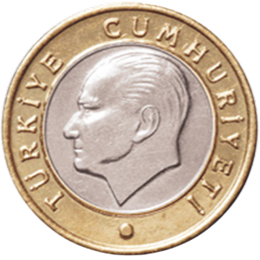
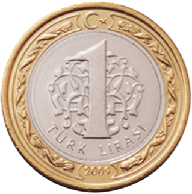

# 🪙 FlipCoin - Heads or Tails Game

**FlipCoin** is a modern and stylish web-based coin toss game that allows users to simulate a real-life "heads or tails" experience. Designed using only HTML, CSS, and vanilla JavaScript, the game features interactive animations, score tracking, and an engaging, colorful interface. Perfect for decision-making or casual fun!

---

## 🎯 Features

* ⚡ Smooth 3D-like coin flip animation
* 🧮 Real-time score tracker for Heads and Tails
* 🎨 Vibrant, randomly changing quadrant background
* 🖱️ Clickable coin or button to initiate flip
* 🔄 Reset function to clear the scores and reset visuals
* 📱 Fully responsive layout for all screen sizes
* 📦 No dependencies or external frameworks

---

## 🖼️ Screenshots

| Heads                | Tails                |
| -------------------- | -------------------- |
|  |  |

---

## 🚀 Live Demo

Try it live on GitHub Pages:
👉 [https://bektas-sari.github.io/flipcoin](https://bektas-sari.github.io/flipcoin)

> *Note: Replace the link with your actual deployment URL if needed.*

---

## 🛠️ Technologies Used

* **HTML5**: Semantic structure
* **CSS3**: Flexbox, gradients, transitions, and keyframe animations
* **JavaScript (ES6)**: DOM manipulation, random logic, event handling

---

## 📁 Project Structure

```
📦 flipcoin/
├── index.html         → Main HTML file
├── style.css          → All styles and animations
├── script.js          → Game logic and interactivity
├── tura.png           → Heads side image
├── yazi.png           → Tails side image
└── README.md          → Project documentation
```

---

## 🧪 How to Run Locally

1. **Clone the repository**:

   ```bash
   git clone https://github.com/bektas-sari/flipcoin.git
   ```
2. **Navigate to the project directory**:

   ```bash
   cd flipcoin
   ```
3. **Launch in your browser**:

   * Double-click `index.html`, or
   * Run with a local server like VS Code Live Server

---

## 📌 Possible Improvements

* ✅ Add sound effects for flip result
* ✅ Include localStorage to persist score between sessions
* ✅ Add coin selection / custom themes
* ✅ Multiplayer or game modes

Pull requests and suggestions are welcome!

---

## 👤 Developer

**Bektas Sari**
📧 Email: [bektas.sari@gmail.com](mailto:bektas.sari@gmail.com)
🐙 GitHub: [github.com/bektas-sari](https://github.com/bektas-sari)
🔗 LinkedIn: [linkedin.com/in/bektas-sari](https://www.linkedin.com/in/bektas-sari)
📚 ResearchGate: [Bektas Sari](https://www.researchgate.net/profile/Bektas-Sari-3)
🎓 Academia: [Bektas Sari](https://independent.academia.edu/bektassari)

---

## 📄 License

This project is licensed under the **MIT License** — see the [LICENSE](LICENSE) file for full terms.

> Feel free to fork this project and build upon it!
